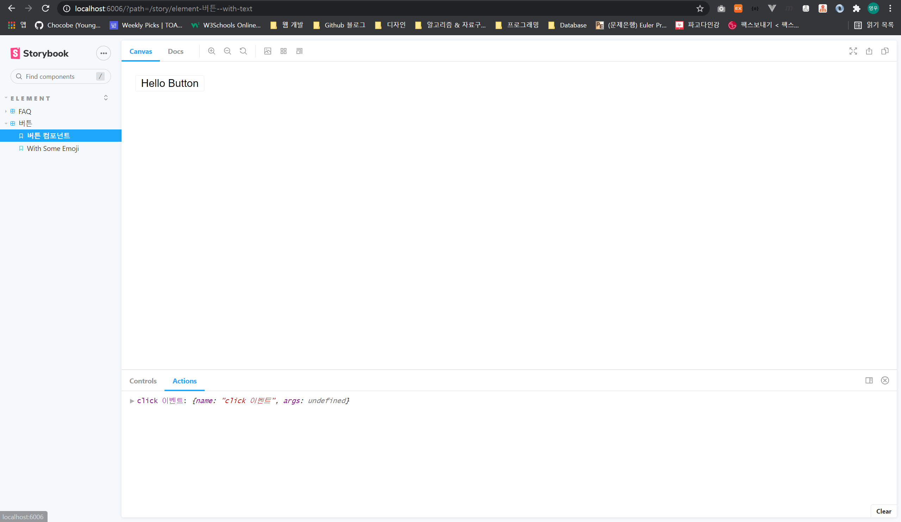

# ``Vue`` 프로젝트와 ``Storybook`` 연동하기

## 1. Vue 프로젝트 생성

먼저 Vue 프로젝트를 생성합니다.

```bash
$ vue create 프로젝트명
```

<br/>

## 2. Vue Addion으로 ``Storybook`` 설치

생성된 Vue 프로젝트에 ``Storybook`` 을 Addion으로 설치 합니다.

```bash
$ vue add storybook
```

<br/>

## 3. ``ESLint``의 ``ignorePatterns`` 설정

현재까지 사용한 결과, ``ESLint``의 ``autofix``가 동작하지 않았습니다.

때문에, ``*.stories.*`` 파일을 생성하거나 변경할 경우, ``ESLint`` 에러가 발생하는 문제가 있습니다.

이를 해결하고 위해, ``ignorePatterns`` 에 ``Storybook`` 파일을 등록 합니다.

```javascript
// .eslintrc.js
module.exports = {
  // ... 생략

  ignorePatterns: ["*.stories.*"]
};
```

<br/>

## 4. Vue 컴포넌트를 ``Storybook`` 에 등록하기

``Storybook``관련 파일은 다음 경로에 위치 합니다.

```bash
경로: 루트/stories/*
```

<br/>

프로젝트에서 작성할 컴포넌트는 ``button`` 컴포넌트로, 클릭 이벤트를 발생 시킵니다.

```vue
경로: 루트/components/MyButton.vue

<template>
  <button @click="onClick">
    {{ name }}
  </button>
</template>

<script lang="ts">
import { Vue, Component } from "vue-property-decorator";

export default class MyButton extends Vue {
  onClick(): void {
    this.$emit("click");
  }
}
</script>
```

<br/>

이제 완성된 컴포넌트를 ``Storybook``에 등록합니다.

```typescript
import { Meta, Story } from "@storybook/vue";
import { action } from "@storybook/addon-actions";

import MyButton from "@components/MyButton.vue";

export default {
  title: "Element/버튼",
} as Meta;

export const story_MyButton: Story = () => ({
  components: { MyButton },
  template: `
    <MyButton @click="action">
      테스트용 버튼
    </MyButton>
  `,
  methods: {
    action: action("click 이벤트"),
  }
});
story_MyButton.storyName = "버튼 컴포넌트";
```

<br/>

``MyButton.vue`` 컴포넌트가 ``Storybook``에 등록 되었습니다.

다음 명령을 사용하여 ``Storybook`` 로컬 서버를 실행 합니다.

```bash
$ npm run storybook:serve
```

